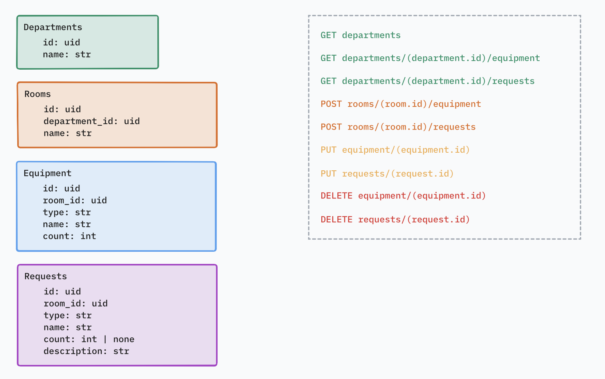
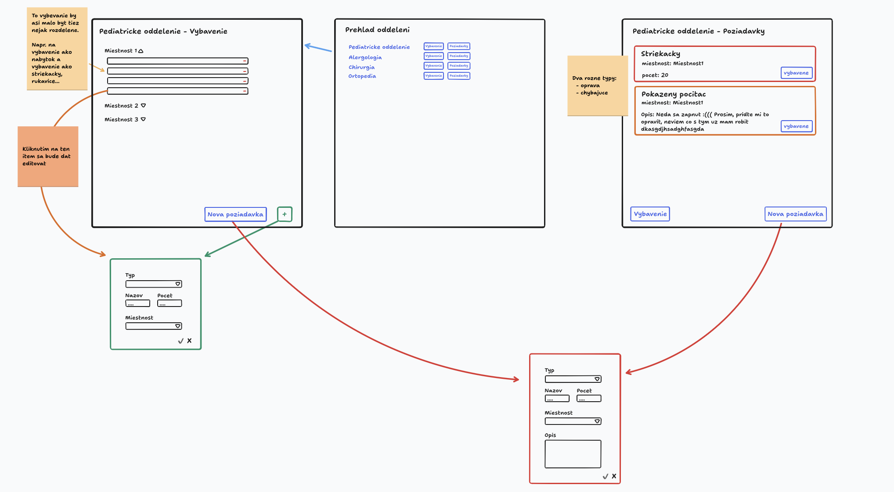

# Evidencia a objednávanie vybavenia nemocnice a ambulancií, s prehľadom umiestnenia a životnosti jednotlivých položiek

Filip Petrán a Jakub Povinec

Github repozitáre pre jednotlivé časti aplikácie:
- [frontend](https://github.com/ns-super-team/fpjp-ambulance-ufe)
- [backend](https://github.com/ns-super-team/fpjp-ambulance-webapi)
- [gitops](https://github.com/ns-super-team/fpjp-ambulance-gitops)
- [dokumentácia](https://github.com/ns-super-team/fpjp-docs)

Na ukladanie vytvorených kontajnerov sme použili GitHub Packages ([register kontajnerov](https://github.com/orgs/ns-super-team/packages)).

Naša aplikácia sa na spoločnom klastri volá [Evidencia vybavenia nemocnice - fpjp](https://wac-24.westeurope.cloudapp.azure.com/ui/fpjp-department/). UI aplikácie je deploynuté ako **fpjp-ambulance-ufe** a webapi ako **fpjp-ambulance-webapi**. 

Frontend je taktiež deploynutý na [Azure](https://fpjp-ambulance.azurewebsites.net), ale nezobrazuje žiaden obsah keďže nie je pripojený k backendu.

## Prípady použitia
- **uc1**: Ako správca vybavenia nemocnice chcem mať možnosť pridávať záznamy o vybavení [create] s informáciou o umiestnení vybavenia (miestnosť/oddelenie). Chcem vedieť upravovať tieto záznamy [update], zobraziť zoznam vybavenia v jednotlivých miestnostiach [read] a odstraňovať záznamy o vybavení [delete].

- **uc2**: Ako zdravotná sestra chcem mať možnosť vytvoriť nový záznam o poškodení alebo o nedostatku určitého vybavenia na oddelení [create]. Ako správca vybavenia si chcem vedieť pozrieť tieto záznamy [read]. Po splnení požiadavky chcem vedieť tento záznam odstrániť [delete]. Záznamy by malo byť taktiež možné aj upravovať [update] napr. v prípade ak by sa zmenilo množstvo chýbajúceho vybavenia.

## Návrh aplikácie
### Backend

Na implementáciu backendu sme využili jazyk Go s frameworkom Gin a ako databázu Mongodb. Celkovo sme v aplikácií použili 4 kolekcie:
- `Departments` obsahuje záznamy pre jednotlivé oddelenia nemocnice.
- `Rooms` predstavuje jednotlivé izby, ktoré sú viazané na oddelenia.
- `Equipment` uchováva záznamy o vybavení. Každé vybavenie má vlastný typ, meno, počet a prislúchajú danej izbe.
- `Requests` predstavujú jednotlivé požiadavky týkajúce sa vybavenia (poškodenie alebo nedostatok určitého vybavenia). Požiadavky taktiež prislúchajú určitej izbe a každá požiadavka má meno, typ a môže mať taktiež počet a nejaký opis.

Aj keď jednou z výhod mongodb je aj to, že kolekcie môžu obsahovať aj vnorené objekty, my sme sa ich rozhodli radšej rozdeliť. V našom prípade by mohli byť `Equipment` a `Requests` rovno vo vnútri `Rooms`, no v tomto prípade by bolo obtiažnejšie ich upravovanie, obzvlášť zmenenie izby, ktorej prislúchajú.

Naše api pozostáva z 9 endpointov ([dokumentácia api endpointov](https://ns-super-team.github.io/fpjp-docs/)):
- GET departments - vracia zoznam vytvorených oddelení
- GET departments/(department.id)/equipment - vracia zoznam izieb daného oddelenia a k nim prislúchajúce vybavenie
- GET departments/(department.id)/equipment - vracia zoznam izieb daného oddelenia a k nim prislúchajúce požiadavky
- POST rooms/(room.id)/equipment - vytvorí nové vybavavenie v danej izbe 
- POST rooms/(room.id)/requests - vytvorí novú požiadavku v danej izbe
- PUT equipment/(equipment.id) - upraví dané vybavenia
- PUT requests/(request.id) - upraví danú požiadavku
- DELETE equipment/(equipment.id) - vymaže dané vybavenie
- DELETE requests/(request.id) - vymaže danú požiadavku

### Frontend

Na vytvorenie frontendu sme použili framework Stenciljs. Naša aplikácia sa skladá z 3 hlavných obrazoviek. 

Úvodnou obrazovkou je "Prehľad oddelení" (komponent `fpjp-department-overview`), z ktorej sa dá prejsť na podstránky pre vybavenia a požiadavky jednotlivých oddelení. 

Podstránka pre vybavenie (komponent `fpjp-department`) obsahuje prehľad vybavenia pre jednotlivé miestnosti v danom oddelení spolu s ich počtom a typom.
